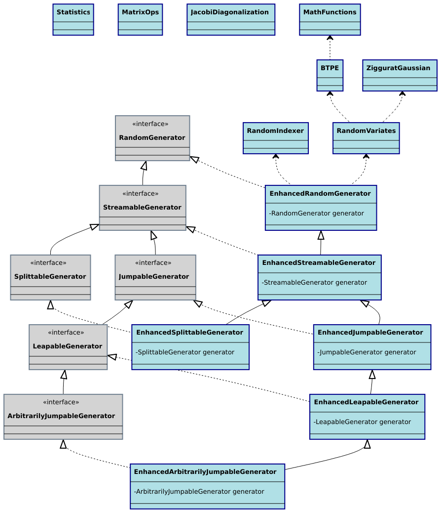

# Summary

The $\rho\mu$ library is a Java library of Randomization enHancements and Other Math Utilities. It originated as a core dependency for our other open source research software libraries, such as JavaPermutationTools [@Cicirello2018b] and Chips-n-Salsa [@Cicirello2020], providing these libraries with efficient randomization related algorithms. For example, Chips-n-Salsa is a library of stochastic local search and evolutionary algorithms, which requires fast generation of random indexes into arrays and other structures, as well as fast generation of non-uniform random numbers to implement Gaussian mutation, Cauchy mutation, etc. The $\rho\mu$ library includes implementations of efficient algorithms for randomly sampling indexes into arrays and other sequential structures, randomly sampling pairs and triples of distinct indexes, randomly sampling $k$ indexes, among others, and also includes efficient random number generation from non-uniform distributions, such as Gaussian, Cauchy, and Binomial. It also includes math functions required by the randomization utilities. The documentation is hosted on the web ([https://rho-mu.cicirello.org/](https://rho-mu.cicirello.org/)), and source code on GitHub ([https://github.com/cicirello/rho-mu](https://github.com/cicirello/rho-mu)), which includes a directory of example programs illustrating $\rho\mu$ usage.

# Functionality

The randomization enhancements provided by $\rho\mu$ include:

* Faster generation of random integers subject to a bound or bound and origin, using the algorithm of @Lemire2019, as well as faster generation of streams of bounded integers. A sample program demonstrates the speed advantage, where on average $\rho\mu$ used 53.3% less CPU time than Java's `RandomGenerator.nextInt(bound)`.
* Faster generation of Gaussian distributed random doubles, with a Java port of the GNU Scientific Library's C implementation [@Voss2014] of the Ziggurat algorithm [@Marsaglia2000; @Leong2005].
* Additional distributions available beyond what is supported by the Java API's `RandomGenerator` classes, such as Binomial and Cauchy random variables.
* Ultrafast, but biased, `nextBiasedInt` methods that exclude rejection sampling to trade-off uniformity for speed, based on @Lemire2019, as well as streams of such biased integers. A sample program shows the substantial speed advantage offered for cases where strict uniformity is not required, where on average $\rho\mu$'s `nextBiasedInt(bound)` used 99.2% less CPU time than Java's `RandomGenerator.nextInt(bound)`.
* Methods for generating random pairs and triples of integers without replacement.
* Methods for generating random samples of $k$ integers without replacement from a range of $n$ integers, including three alternative algorithms, reservoir sampling [@Vitter1985], pool sampling [@Ernvall1982], and insertion sampling [@Cicirello2022], as well as a method that chooses among these based on $n$ and $k$.
* Streams from binomial, Cauchy, exponential, and Gaussian distributions.

The GitHub repository includes the data and t-Test results demonstrating the speed enhancements at extremely statistically significant levels, using Windows 10 on an AMD A10-5700 3.4GHz CPU with 8GB DDR3 RAM. 

# Architecture

\autoref{fig:uml} provides a UML diagram illustrating the architecture of the library. Java 17 introduced a `RandomGenerator` interface, and five nested subinterfaces for special types of random number generator. The $\rho\mu$ library provides a hierarchy of wrapper classes corresponding to Java 17's `RandomGenerator` interface hierarchy. This enables using $\rho\mu$'s `EnhancedRandomGenerator`, and its subclasses, as drop-in replacements in existing applications.

# Statement of Need

The original motivation for the $\rho\mu$ library is to provide efficient algorithms for randomization operations commonly needed by stochastic local search [@Hoos2018] and evolutionary algorithms [@Petrowski2017; @Doerr2019]. Such algorithms rely heavily on randomized behavior, including the need to generate very many random indexes into linear structures such as vectors of bits. Sometimes independent random indexes are required, while other times (such as for a $k$-point crossover) a random sample without replacement is necessary. For real-valued optimization problems, evolutionary algorithms require random numbers from non-uniform distributions such as for Gaussian mutation [@Hinterding1995] or Cauchy mutation [@Szu1987]. Our prior research showed that evolutionary algorithms are so reliant upon random number generation that one can achieve as much as a 25% speed up by optimizing choice of random number algorithms alone [@Cicirello2018a].

Efficient randomization has important research applications in a variety of other areas as well, such as in modeling and simulation [@Zhang2019; @Rabe2020; @Greasley2021], domain randomization [@Tobin2017] for sim-to-real transfer learning [@Zhao2020], among others.

Java 17 introduced a substantial overhaul of its random number support, adding a hierarchy of interfaces, where no common interface previously existed; as well as adding several pseudorandom number generators (PRNG) along with a factory class. Java libraries exist, such as Apache Commons [@Apache2021], PRNGine [@Jenetics2022], and Uncommons Maths [@Dyer2014], that provide additional PRNGs and in some cases specialized algorithms for sampling, additional distributions, and other randomization operations. But, I believe that $\rho\mu$ is the first library to be designed around Java 17's `RandomGenerator` interface hierarchy, providing a convenient mechanism to add support for additional specialized randomization operations to any of Java 17's PRNGs or even those from other libraries like Apache Commons. $\rho\mu$'s architecture provides a drop-in replacement approach enabling easily upgrading randomization functionality of existing PRNGs in existing applications. 

# References
